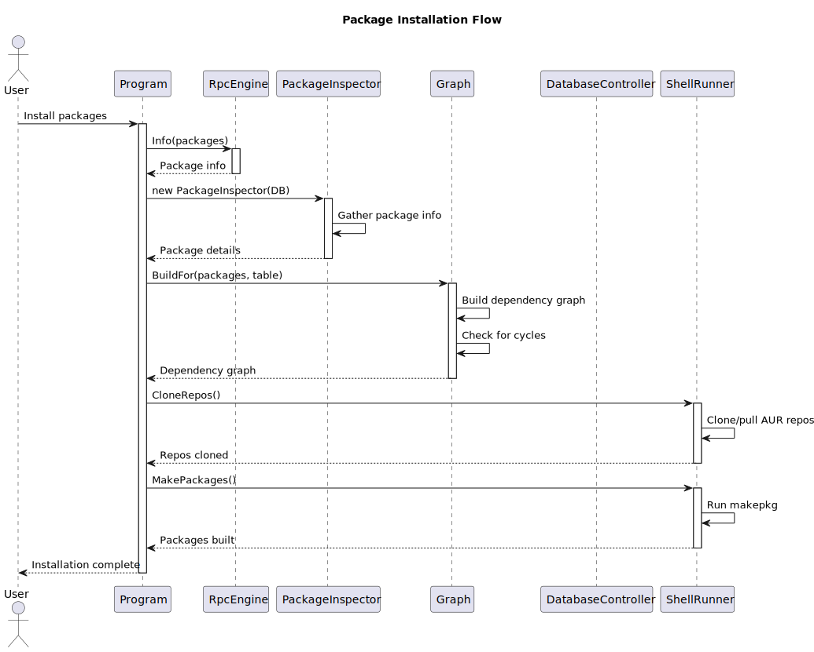
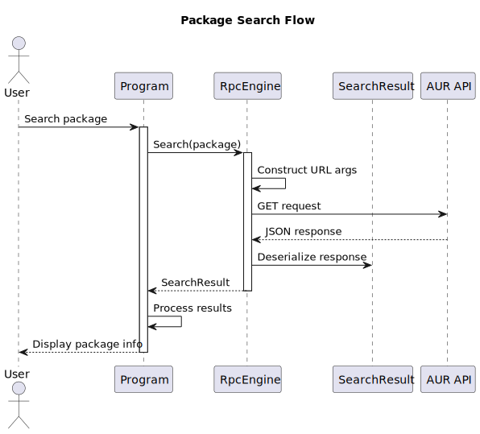
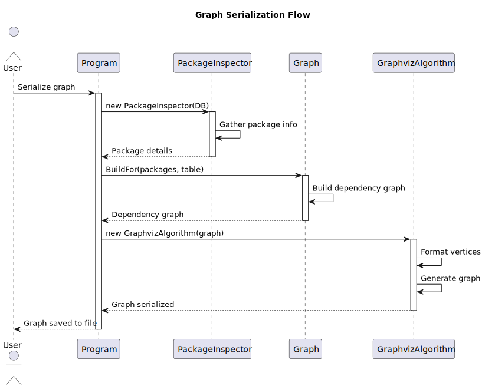
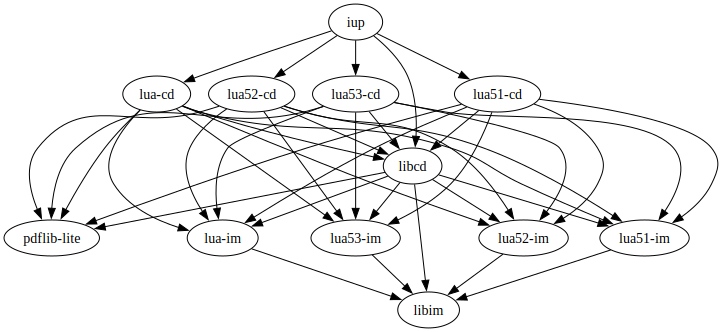
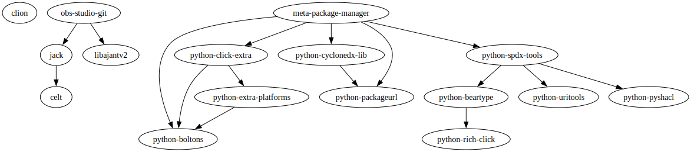

# yaah
## Yet another AUR helper
yaah (Yet Another AUR Helper) is a command-line utility written in C# designed to simplify the interaction with the
[Arch User Repository (AUR)](https://aur.archlinux.org/). The primary purpose of the program is to 
allow users to search, install, and update AUR packages, tasks that are not directly supported by the 
default Arch Linux's package manager [`pacman`](https://wiki.archlinux.org/title/Pacman).

## Features
- Searching for AUR packages
- Installing/Updating AUR packages
- Serializing graph for given packages
## Installation/Cloning
### Arch Linux based systems
```shell
sudo pacman -S --needed git base-devel dotnet-runtime-8.0; git clone https://github.com/inquaterni/yaah.git; cd ./yaah
```
### On Windows through WSL 2
Check if `archlinux` is available
```shell
wsl -l -o
```
If `archlinux` is in list, install it with
```shell
wsl --install archlinux
```
Proceed to [Arch Linux installation](#arch-linux-based-systems)
## Usage
### Basic
Print help
```shell
dotnet run --project ./Yaah.CLI/Yaah.CLI.csproj -- --help
```
Install/Update packages
```shell
dotnet run --project ./Yaah.CLI/Yaah.CLI.csproj -S <aur-package-name> <another-aur-package-name> ...
```
### Debug
Enable debug logging level
```shell
dotnet run --project ./Yaah.CLI/Yaah.CLI.csproj -D <other options>
```
Serialize graph for given package (does not install package)
```shell
dotnet run --project ./Yaah.CLI/Yaah.CLI.csproj -Dgс <aur-package-name> <output-path>
```

## Overview
### Libraries used
- `System.Text.Json`
  Chosen for performance and native support in .NET. Lightweight and fast for serializing/deserializing 
  AUR RPC responses.
- `CommandLineParser`
  Simple and flexible command-line argument parser with excellent support for verbs and help texts.
- `QuikGraph`
  Provides a clean graph abstraction and algorithms like DFS for topological sorting of package dependencies, 
  allows serialization of graphs.
- `NLog`
  NLog is a flexible and free logging platform for various .NET platforms, including .NET standard.
  NLog makes it easy to write to several targets. (console, file, database, etc.) and change the logging configuration
  on-the-fly.
- `libalpm`
  Using `libalpm` ensures that once a package is built, the installation step is indistinguishable from any other
  Arch package—no need to maintain a parallel metadata store for what's installed.

### Alternatives Considered
- `System.CommandLine`
  At the time of development the System.CommandLine API was in preview and underwent breaking changes frequently.
  Also, required manually building root commands, options, and handlers, which felt overly verbose for a small CLI.
- `Newtonsoft.Json`
  Was considered but rejected due to larger footprint and slower performance for the specific use-case.
- `CLI Parsing for db`
  Was rejected because relying solely on parsing output of CLI tools (like pacman -Q) is brittle and error-prone.
- `Custom SQLite-only Database`
  Might diverge from the actual system state if the user uses pacman separately.
  Also, you lose `libalpm`'s transaction guarantees.
- `Microsoft.Extensions.Logging`
  Because `yaah` may log hundreds of lines per package build and dependency resolution, the speed and
  flexibility of NLog were prioritized over the more "built-in" but less feature-complete `Microsoft.Extensions.Logging`

### Main Classes
- `Program`
  The main entry point of the application. Handles command-line argument parsing and orchestrates the main program flows.
- `RpcEngine`
  Manages communication with the AUR API. Handles HTTP requests for package search and information retrieval.
- `DatabaseController`
  Provides an interface to the local pacman database using `libalpm`. Manages package information and database operations.
- `PackageInspector`
  Analyzes package dependencies and version requirements. Processes package information for dependency resolution.
- `Graph`
  Implements dependency resolution using graph algorithms. Builds and validates dependency graphs for package installation.
- `ShellRunner`
  Executes shell commands for package building and installation. Manages the interaction with makepkg and git.

### Application Structure
The application follows a modular architecture with clear separation of concerns across several projects:

#### Project Organization
- `Yaah.CLI`: Command-line interface and program entry point
  - Contains the main program logic and user interaction
  - Handles command-line argument parsing and program flow orchestration
  - Entry point for all user operations

- `Yaah.Net`: Network and data handling
  - Manages communication with AUR API
  - Contains data models for package information
  - Handles package information processing and dependency analysis

- `Yaah.Infrastructure`: System-level operations
  - Provides database access through `libalpm`
  - Manages system-level operations and shell commands
  - Handles low-level system interactions

- `Yaah.DReS`: Dependency Resolution System
  - Implements graph-based dependency resolution
  - Handles package dependency analysis and validation
  - Manages installation order determination

#### Component Interaction
1. **User Interface Layer** (`Yaah.CLI`)
   - Receives user commands and parameters
   - Coordinates between different components
   - Provides user feedback and error handling

2. **Data Layer** (`Yaah.Infrastructure`)
   - Manages data retrieval and storage
   - Handles API communication
   - Processes package information

3. **Business Logic Layer** (`Yaah.DReS`, `Yaah.Net`)
   - Implements core package management logic
   - Handles dependency resolution
   - Manages package installation workflow

## Program flow
### Installation

### Searching

### Serializing graph

#### Examples
Single package

Multiple packages
